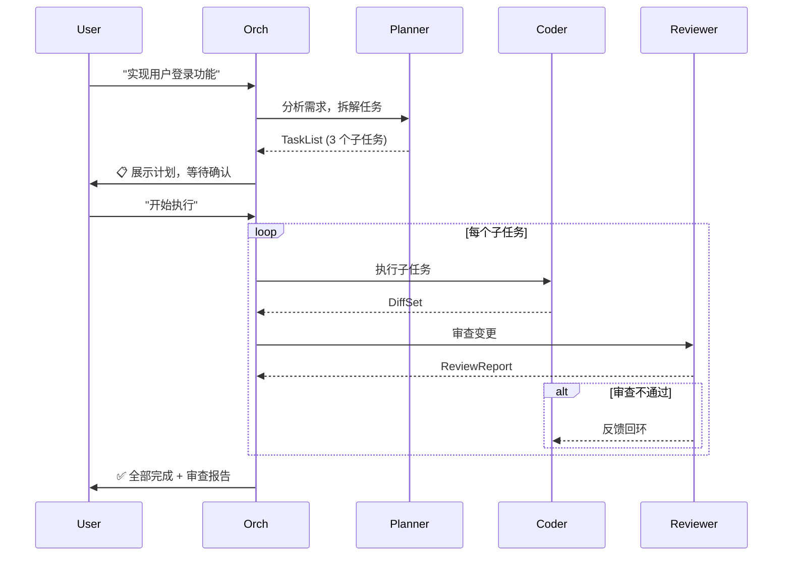
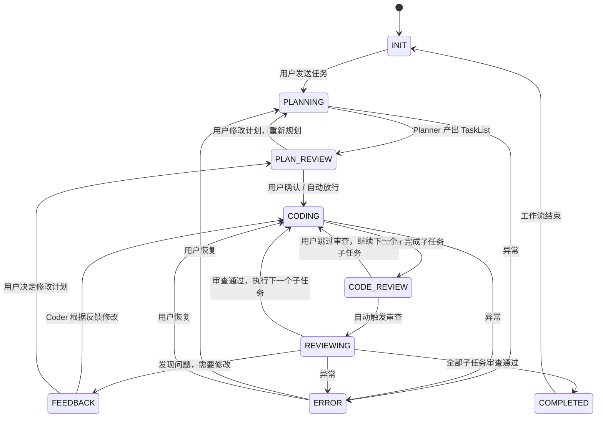

# 工作流引擎设计

> v0.4 阶段 | 状态：设计中 | 依赖：v0.3 完成
>
> 目标：从「单轮用户消息 → Agent 回复」升级为「Plan → Code → Review 自动闭环」。

---

## 1. 动机

### 1.1 当前局限

`AgentOrchestrator.run_user_message()` 是纯单轮模型：

```
用户消息 → (并行研究) → main Agent tool-calling → 回复用户
```

虽然支持 `delegate_agent` 委派子 Agent，但**不存在自动阶段流转**：
- 没有"规划完成 → 自动开始编码"
- 没有"编码完成 → 自动触发审查"
- 阶段之间靠用户手动推动

这意味着多 Agent 角色体系（planner / coder / reviewer）的实际价值未释放——它们只是被动的工具，而非主动协作的流水线。

### 1.2 目标行为



---

## 2. 核心架构

### 2.1 两层解耦

```
工作流引擎 (WorkflowRunner)
  ├─ 阶段状态机：决定「现在该干什么」
  ├─ 阶段间数据：TaskList → DiffSet → ReviewReport
  └─ 自动触发：产出物就绪 → 调度下一阶段

Agent 执行层 (现有 Orchestrator)
  ├─ 单阶段内 tool-calling 循环
  ├─ 委派/handoff、并行研究
  └─ staging / permission 安全边界
```

**原则**：工作流引擎不关心 Agent 内部怎么执行，只关心阶段产出物和转换条件。Agent 执行层不感知工作流状态。

### 2.2 新增模块

```text
backend/
  workflow/
    __init__.py           # 导出 WorkflowRunner
    types.py              # TaskList, DiffSet, ReviewReport 等数据结构
    engine.py             # WorkflowRunner — 阶段状态机主循环
    triggers.py           # 阶段转换触发条件 + 自动调度逻辑
    context.py            # 阶段间上下文管理（注入/剪枝策略）
```

### 2.3 修改模块

| 文件 | 变更 |
|---|---|
| `backend/types.py` | `Phase` enum 扩展、新增工作流数据类型 |
| `backend/orchestrator.py` | 入口改为委托到 WorkflowRunner；保留单 Agent 执行逻辑 |
| `backend/prompt_builder.py` | 阶段感知提示词（coder 收到 TaskList、reviewer 收到 DiffSet） |
| `backend/session.py` | 阶段状态持久化、工作流产物存储 |
| `frontend/src/types.ts` | 工作流事件类型、产物展示类型 |
| `frontend/src/SessionContext.tsx` | 新增 `workflow.*` 事件处理 |
| `frontend/src/components/ChatArea.tsx` | 工作流阶段可视化卡片 |

---

## 3. 阶段状态机

### 3.1 阶段定义

```python
class Phase(str, Enum):
    INIT         = "init"          # 会话开始，等待用户输入
    PLANNING     = "planning"      # Planner 正在分析需求
    PLAN_REVIEW  = "plan_review"   # 计划已产出，等待用户确认/修改
    CODING       = "coding"        # Coder 正在执行子任务
    CODE_REVIEW  = "code_review"   # 编码产出，等待进入审查 / 用户介入
    REVIEWING    = "reviewing"     # Reviewer 正在审查变更
    FEEDBACK     = "feedback"      # 审查不通过，等待 coder 修改 / 用户决策
    COMPLETED    = "completed"     # 全部子任务完成，审查通过
    ERROR        = "error"         # 执行失败
```

### 3.2 状态转换图



### 3.3 进入/退出守卫

每个阶段转换前执行守卫检查：

```python
@dataclass
class PhaseGuard:
    """阶段转换守卫条件"""

    def can_enter_planning(self, session: Session) -> bool:
        return session.phase in (Phase.INIT, Phase.ERROR, Phase.COMPLETED)

    def can_enter_coding(self, session: Session) -> bool:
        has_tasklist = session.workflow_state and session.workflow_state.task_list
        user_approved = session.workflow_state and session.workflow_state.plan_approved
        return has_tasklist and user_approved

    def can_enter_reviewing(self, session: Session) -> bool:
        # 当前子任务有 diff 产出、auto_review 开启
        return bool(session.workflow_state.current_diff_set) and session.auto_review
```

---

## 4. 阶段间数据结构

### 4.1 TaskList（Planner 产出 → Coder 消费）

```python
@dataclass
class SubTask:
    """单个子任务"""
    id: str                    # "task-1"
    title: str                 # "创建 User 模型"
    description: str           # 详细描述
    files_involved: list[str]  # 预估涉及的文件
    acceptance_criteria: str   # 验收标准
    priority: int = 0          # 优先级
    status: str = "pending"    # pending | in_progress | done | skipped


@dataclass
class TaskList:
    """规划产出物"""
    overview: str              # 方案概述
    tasks: list[SubTask]       # 有序子任务列表
    risks: list[str]           # 识别到的风险
    estimated_effort: str      # 预估工时
    current_task_index: int = 0
```

### 4.2 DiffSet（Coder 产出 → Reviewer 消费）

```python
@dataclass
class DiffSet:
    """编码产出物——复用已有 CommitResult"""
    task_id: str               # 对应的子任务 ID
    files_changed: int
    diffs: list[FileDiff]      # 复用 backend.types.FileDiff
    combined_diff: str         # 合并 diff
    summary: str               # 变更摘要
    test_results: str | None   # coder 运行的测试结果（可选）
```

### 4.3 ReviewReport（Reviewer 产出 → Coder / User 消费）

```python
@dataclass
class FileReview:
    """单文件审查意见"""
    file_path: str
    issues: list[str]          # 发现的问题
    suggestions: list[str]     # 改进建议
    severity: str              # "blocker" | "warning" | "info"


@dataclass
class ReviewReport:
    """审查报告"""
    task_id: str               # 对应子任务
    overall_verdict: str       # "approved" | "needs_changes" | "rejected"
    file_reviews: list[FileReview]
    summary: str
    should_retry: bool         # 是否需要 coder 修改后重审
```

---

## 5. WorkflowRunner 核心流程

### 5.1 伪代码

```python
class WorkflowRunner:
    def __init__(self, orchestrator: AgentOrchestrator, agent_store: AgentStore):
        self._orchestrator = orchestrator
        self._agent_store = agent_store

    async def execute(self, session: Session, user_text: str, broadcast: Broadcast):
        """工作流主循环：自动推进阶段直到需要用户输入或完成。"""
        while True:
            phase = session.phase

            if phase == Phase.INIT:
                await self._start_planning(session, user_text, broadcast)

            elif phase == Phase.PLANNING:
                task_list = await self._run_planner(session, user_text, broadcast)
                if task_list is None:
                    return  # 错误
                session.workflow_state.task_list = task_list
                await self._show_plan(session, broadcast)
                # 等待用户确认
                return

            elif phase == Phase.PLAN_REVIEW:
                # 用户已确认 / 自动放行
                session.phase = Phase.CODING

            elif phase == Phase.CODING:
                task = session.workflow_state.current_task
                if task is None:
                    session.phase = Phase.COMPLETED
                    continue
                diff_set = await self._run_coder(session, task, broadcast)
                if diff_set is None:
                    return
                session.workflow_state.current_diff_set = diff_set
                session.phase = Phase.CODE_REVIEW

            elif phase == Phase.CODE_REVIEW:
                if session.auto_review:
                    session.phase = Phase.REVIEWING
                else:
                    return  # 等待用户触发审查

            elif phase == Phase.REVIEWING:
                report = await self._run_reviewer(session, broadcast)
                if report.should_retry:
                    session.phase = Phase.FEEDBACK
                    # 注入反馈到 coder 上下文
                    self._inject_review_feedback(session, report)
                else:
                    self._advance_to_next_task(session)

            elif phase == Phase.FEEDBACK:
                # Coder 重试当前子任务
                session.phase = Phase.CODING

            elif phase == Phase.COMPLETED:
                await self._broadcast_completion(session, broadcast)
                return

            elif phase == Phase.ERROR:
                return  # 等待用户介入

            # 持久化当前状态
            session.save()
```

### 5.2 单阶段 Agent 执行

每个阶段内仍走现有 `Agent.run()` tool-calling 循环。WorkflowRunner 只负责：
1. 选择合适的 Agent 定义（planner / coder / reviewer）
2. 构建阶段感知的 system prompt + user message
3. 从 Agent 回复中**解析结构化产出物**
4. 决定下一阶段

### 5.3 阶段感知的提示词注入

```python
def build_phase_prompt(
    session: Session,
    agent_def: AgentDefinition,
    phase: Phase,
) -> str:
    base = build_system_prompt(session, agent_def)

    if phase == Phase.CODING:
        task = session.workflow_state.current_task
        base += f"\n\n当前任务：\n{task.title}\n{task.description}\n"
        base += f"涉及文件：{', '.join(task.files_involved)}\n"
        base += f"验收标准：{task.acceptance_criteria}\n"

    elif phase == Phase.REVIEWING:
        diff = session.workflow_state.current_diff_set
        base += f"\n\n待审查变更：\n{diff.combined_diff[:8000]}\n"
        base += f"变更摘要：{diff.summary}\n"

    elif phase == Phase.FEEDBACK:
        report = session.workflow_state.last_review_report
        base += f"\n\n审查反馈：\n{report.summary}\n"
        for fr in report.file_reviews:
            if fr.severity == "blocker":
                base += f"  [{fr.file_path}] " + "; ".join(fr.issues) + "\n"

    return base
```

---

## 6. 结构化产出物解析

### 6.1 解析策略

LLM 回复是自然语言，需要从中提取结构化数据。两种方案：

**方案 A：Prompt 约束 + 文本解析（优先）**
- 在 stage-specific prompt 中要求 LLM 以约定格式输出
- 使用标记分隔：`---TASKLIST_START---` / `---TASKLIST_END---`
- 对标记间内容做 JSON 解析，失败则用启发式回退

**方案 B：Tool call 产出（备选）**
- 定义 `submit_task_list` / `submit_diff_summary` / `submit_review_report` 工具
- LLM 通过 tool call 提交结构化产出
- 更可靠，但增加一个 tool call round-trip

**建议**：先用方案 A 快速落地，解析失败时用方案 B 兜底。

```python
def parse_task_list(text: str) -> TaskList | None:
    """从 LLM 文本回复中提取 TaskList。"""
    pattern = r'---TASKLIST_START---\s*(.*?)\s*---TASKLIST_END---'
    match = re.search(pattern, text, re.DOTALL)
    if match:
        try:
            data = json.loads(match.group(1))
            return TaskList(**data)
        except (json.JSONDecodeError, TypeError):
            pass
    # 启发式回退：按 "1. " "2. " 编号拆分
    return _heuristic_parse_tasks(text)
```

### 6.2 解析失败处理

```python
if task_list is None:
    # LLM 产出物无法解析 → 退回用户，展示原始回复
    await broadcast("workflow.parse_failed", {
        "phase": "planning",
        "raw_output": plan_text,
        "error": "无法解析计划结构，请检查 Planner 输出格式"
    })
    session.phase = Phase.ERROR
    return
```

---

## 7. 用户介入机制

### 7.1 接入点

| 阶段 | 用户可操作 |
|---|---|
| `PLAN_REVIEW` | 确认计划、修改子任务、补充需求 |
| `CODE_REVIEW` | 跳过审查、手动触发审查、直接修改代码 |
| `FEEDBACK` | 接受有风险代码、修改计划、手动修复 |
| 任意阶段 | **终端中断**（Ctrl+C 或前端停止按钮）→ `session.interrupt_requested = True` |

### 7.2 前端命令

```typescript
// 新增 WS 命令
type WSCommand =
  | { type: 'workflow.approve_plan' }        // 确认计划
  | { type: 'workflow.modify_plan'; payload: { changes: string } }
  | { type: 'workflow.skip_review' }         // 跳过当前审查
  | { type: 'workflow.force_review' }        // 手动触发审查
  | { type: 'workflow.skip_task'; payload: { task_id: string } }
  | { type: 'workflow.retry_task' }          // 重试当前子任务
  | { type: 'workflow.abort' }               // 终止工作流
```

### 7.3 后端处理

`WorkflowRunner` 在执行循环中检查用户命令队列：

```python
async def execute(self, session, user_text, broadcast):
    while True:
        # 检查是否有待处理的用户命令
        if session.user_command_queue:
            cmd = session.user_command_queue.pop(0)
            handled = await self._handle_user_command(session, cmd, broadcast)
            if handled:
                continue  # 重新评估阶段

        # 正常阶段流转...
```

---

## 8. 中断与恢复

### 8.1 会话级持久化

阶段状态存入 `Session`：

```python
@dataclass
class WorkflowState:
    """工作流运行时状态（持久化到 session JSON）"""
    task_list: TaskList | None = None
    current_diff_set: DiffSet | None = None
    last_review_report: ReviewReport | None = None
    plan_approved: bool = False
    completed_tasks: list[str] = field(default_factory=list)  # task_id 列表
    user_command_queue: list[dict] = field(default_factory=list)
```

### 8.2 恢复流程

```
用户重新打开会话 → session.ready 事件 → 前端恢复阶段 UI
  ├─ TaskList 仍存在 → 展示计划卡片 + 当前进度
  ├─ DiffSet 仍存在 → 展示变更 + 审查状态
  └─ 用户可选择继续 / 重试 / 放弃
```

---

## 9. 上下文治理

### 9.1 阶段剪枝策略

不同阶段只注入相关的上下文：

| 阶段 | 注入内容 | 排除内容 |
|---|---|---|
| `PLANNING` | 项目结构摘要、需求文本 | diff 历史、审查报告 |
| `CODING` | 当前任务描述、相关文件内容 | 其他子任务细节、审查历史 |
| `REVIEWING` | 当前 diff、任务验收标准 | plan 草稿、其他子任务 |

通过 `context_builder.build_phase_context(session, phase)` 懒加载。

### 9.2 Token 预算分配

```python
PHASE_TOKEN_BUDGET = {
    Phase.PLANNING:   0.6,   # 60% 给项目上下文
    Phase.CODING:     0.4,   # 40% 给上下文，60% 给代码
    Phase.REVIEWING:  0.3,   # 30% 给上下文，70% 给 diff
}
```

---

## 10. 前端可视化

### 10.1 工作流时间线

```
┌────────────────────────────────────────────┐
│  📋 方案规划            [已完成] 2s         │
│  分析需求，拆解为 3 个子任务                │
│  ┌─────────────────────────────────────┐   │
│  │ 1. 创建 User 模型          [✓]      │   │
│  │ 2. 实现登录接口            [进行中]  │   │
│  │ 3. 添加单元测试            [...]     │   │
│  └─────────────────────────────────────┘   │
├────────────────────────────────────────────┤
│  💻 编码专家 (coder)      [进行中]         │
│  正在执行：实现登录接口                     │
├────────────────────────────────────────────┤
│  🔍 代码审查员 (reviewer)  [等待中]        │
└────────────────────────────────────────────┘
```

### 10.2 新组件

| 组件 | 职责 |
|---|---|
| `WorkflowTimeline.tsx` | 阶段泳道图，显示各阶段状态和进度 |
| `TaskListCard.tsx` | 子任务列表，支持勾选和展开详情 |
| `DiffPreviewCard.tsx` | diff 预览卡片（复用 FileChangeCard） |
| `ReviewReportCard.tsx` | 审查报告卡片，按文件分组展示问题 |
| `WorkflowBanner.tsx` | 阶段横幅，显示当前状态和操作按钮 |

---

## 11. 实施计划

### 11.1 分步实施

| 步骤 | 内容 | 估时 | 测试策略 |
|---|---|---|---|
| **Step 1** | 数据类型落地：`TaskList` / `DiffSet` / `ReviewReport` / `WorkflowState` | 0.5d | 序列化往返测试 |
| **Step 2** | `WorkflowRunner` 状态机骨架：阶段枚举 + 转换规则 + 循环框架 | 1d | 纯 Mock Agent 的阶段流转测试 |
| **Step 3** | 阶段提示词增强：`build_phase_prompt()` + 上下文剪枝 | 0.5d | prompt 生成快照测试 |
| **Step 4** | 产出物解析：`parse_task_list()` / `parse_review_report()` | 0.5d | 正例 + 反例 + 启发式回退 |
| **Step 5** | 自动触发串联：plan → code → review 完整链路 | 1d | 集成测试（Mock LLM，验证触发链路） |
| **Step 6** | 用户命令处理：确认/跳过/修改/中断 | 0.5d | 命令队列测试 |
| **Step 7** | 阶段状态持久化 + 恢复 | 0.5d | `WorkflowState` 序列化 + 恢复测试 |
| **Step 8** | 前端工作流时间线 + 阶段卡片 | 1.5d | 手动验证 |
| **Step 9** | 端到端联调 + 边界 case | 1d | E2E 测试 |

**总计**：约 7 个工作日（含前端）

### 11.2 里程碑

| 里程碑 | 交付物 |
|---|---|
| **M1: 数据结构 + 状态机** | `TaskList`/`WorkflowRunner` 可独立运行，通过 Mock 测试 |
| **M2: 单阶段增强** | planner/coder/reviewer 各自收到正确的阶段上下文 |
| **M3: 全链路串联** | plan → code → review 自动流转，人工可在关键节点介入 |
| **M4: 前端可用** | 工作流时间线可见、阶段卡片可交互、命令按钮可用 |

---

## 12. 风险与应对

| 风险 | 应对 |
|---|---|
| LLM 产出物格式不稳定 | 方案 A（文本解析）+ 方案 B（tool call）兜底双保险 |
| 子任务执行失败后状态不一致 | 每个子任务执行前 staging baseline，失败自动 rollback |
| 上下文膨胀导致 token 溢出 | 阶段剪枝 + token 预算 + 超限时 oldest-first 截断 |
| 阶段自动转换陷入死循环 | 最大重试次数 + 阶段超时 + 用户可随时中断 |
| 前端复杂度激增 | 复用现有 ToolCallCard / FileChangeCard，渐进式扩展而非重写 |

---

## 13. 未覆盖场景（暂不做）

- 并行子任务执行（同时修多个文件的不同部分）
- 工作流模板（用户自定义阶段和角色组合）
- Agent 间直接通信协议（不通过 orchestrator）
- 跨会话工作流断点续跑（关闭重开后从上次阶段继续）
- 条件分支工作流（如"如果测试失败则回退，否则继续"）
