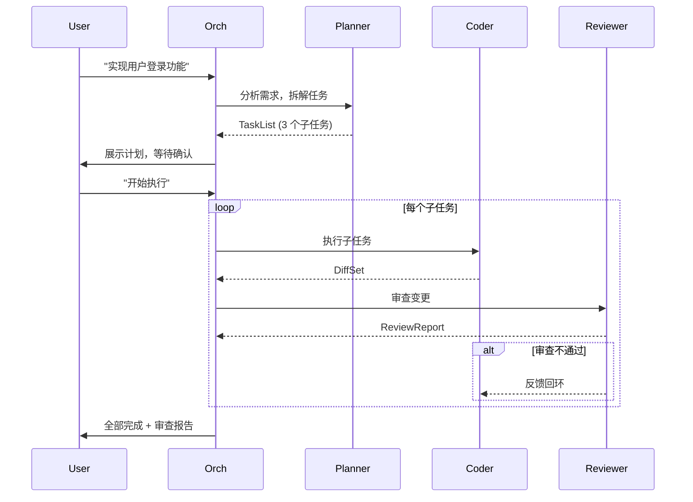
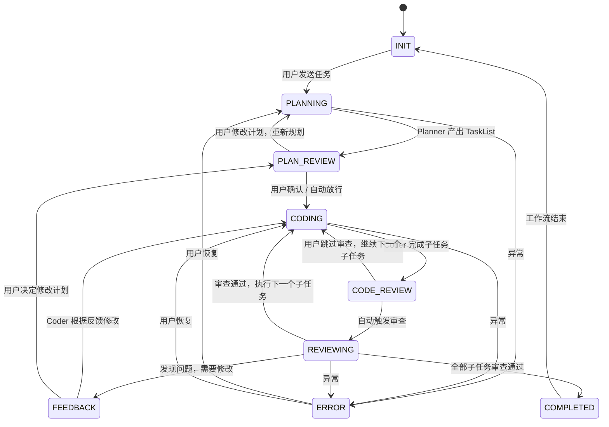

# 工作流引擎设计

> v0.4 阶段 | 状态：进行中 | 已完成 Step 1-7
>
> 目标：从「单轮用户消息 → Agent 回复」升级为「Plan → Code → Review 自动闭环」。

---

## 1. 动机

### 1.1 当前局限

`AgentOrchestrator.run_user_message()` 是纯单轮模型：

```
用户消息 → (并行研究) → main Agent tool-calling → 回复用户
```

虽然支持 `delegate_agent` 委派子 Agent，但**不存在自动阶段流转**：
- 没有"规划完成 → 自动开始编码"
- 没有"编码完成 → 自动触发审查"
- 阶段之间靠用户手动推动

这意味着多 Agent 角色体系（planner / coder / reviewer）的实际价值未释放——它们只是被动的工具，而非主动协作的流水线。

### 1.2 目标行为



---

## 2. 核心架构

### 2.1 两层解耦

```
工作流引擎 (WorkflowRunner)
  ├─ 阶段状态机：决定「现在该干什么」
  ├─ 阶段间数据：TaskList → DiffSet → ReviewReport
  └─ 自动触发：产出物就绪 → 调度下一阶段

Agent 执行层 (现有 Orchestrator)
  ├─ 单阶段内 tool-calling 循环
  ├─ 委派/handoff、并行研究
  └─ staging / permission 安全边界
```

**原则**：工作流引擎不关心 Agent 内部怎么执行，只关心阶段产出物和转换条件。Agent 执行层不感知工作流状态。

### 2.2 新增模块

```text
backend/
  workflow/
    __init__.py           # 导出 WorkflowRunner
    types.py              # TaskList, DiffSet, ReviewReport 等数据结构（已完成）
    engine.py             # WorkflowRunner — 阶段状态机主循环（已完成）
    parser.py             # 产出物解析器——JSON 标记 + 启发式回退（已完成）
  cli.py                  # CLI 入口——命令行触发工作流（已完成）
  prompt_builder.py       # 阶段感知提示词 build_phase_prompt（已完成）
  orchestrator.py         # run_workflow_agent 方法——工作流阶段 Agent 执行（已完成）
```

### 2.3 修改模块

| 文件 | 变更 | 状态 |
|---|---|---|
| `backend/workflow/types.py` | `Phase` enum 扩展、新增工作流数据类型 | 已完成 |
| `backend/workflow/engine.py` | 阶段执行器实现（planner/coder/reviewer 真实调用） | 已完成 |
| `backend/workflow/parser.py` | 产出物解析（文本标记 + 启发式回退） | 已完成 |
| `backend/orchestrator.py` | 新增 `run_workflow_agent` 方法 | 已完成 |
| `backend/prompt_builder.py` | 阶段感知提示词 `build_phase_prompt` | 已完成 |
| `backend/cli.py` | CLI 入口——命令行触发工作流 | 已完成 |
| `backend/session.py` | 阶段状态持久化、工作流产物存储 | 已完成 |
| `frontend/src/types.ts` | 工作流事件类型、产物展示类型 | 待开始 |
| `frontend/src/SessionContext.tsx` | 新增 `workflow.*` 事件处理 | 待开始 |
| `frontend/src/components/ChatArea.tsx` | 工作流阶段可视化卡片 | 待开始 |

---

## 3. 阶段状态机

### 3.1 阶段定义

```python
class Phase(str, Enum):
    INIT         = "init"          # 会话开始，等待用户输入
    PLANNING     = "planning"      # Planner 正在分析需求
    PLAN_REVIEW  = "plan_review"   # 计划已产出，等待用户确认/修改
    CODING       = "coding"        # Coder 正在执行子任务
    CODE_REVIEW  = "code_review"   # 编码产出，等待进入审查 / 用户介入
    REVIEWING    = "reviewing"     # Reviewer 正在审查变更
    FEEDBACK     = "feedback"      # 审查不通过，等待 coder 修改 / 用户决策
    COMPLETED    = "completed"     # 全部子任务完成，审查通过
    ERROR        = "error"         # 执行失败
```

### 3.2 状态转换图



### 3.3 进入/退出守卫

每个阶段转换前执行守卫检查。`PhaseGuard` 已在 `types.py` 中实现：

```python
@dataclass
class PhaseGuard:
    """阶段转换守卫条件"""

    @staticmethod
    def can_enter_planning(session: Session) -> bool:
        return session.phase in (Phase.INIT, Phase.ERROR, Phase.COMPLETED)

    @staticmethod
    def can_enter_plan_review(session: Session) -> bool:
        return (
            session.phase == Phase.PLANNING
            and session.workflow_state is not None
            and session.workflow_state.task_list is not None
        )

    @staticmethod
    def can_enter_coding(session: Session) -> bool:
        ws = session.workflow_state
        return (
            session.phase in (Phase.PLAN_REVIEW, Phase.FEEDBACK, Phase.CODING)
            and ws is not None
            and ws.task_list is not None
            and ws.plan_approved
        )

    @staticmethod
    def can_enter_reviewing(session: Session) -> bool:
        ws = session.workflow_state
        return (
            session.phase == Phase.CODE_REVIEW
            and ws is not None
            and ws.current_diff_set is not None
        )

    @staticmethod
    def can_enter_feedback(session: Session) -> bool:
        ws = session.workflow_state
        return (
            session.phase == Phase.REVIEWING
            and ws is not None
            and ws.last_review_report is not None
            and ws.last_review_report.should_retry
        )

    @staticmethod
    def can_enter_completed(session: Session) -> bool:
        ws = session.workflow_state
        if ws is None or ws.task_list is None:
            return False
        return (
            session.phase in (Phase.REVIEWING, Phase.CODE_REVIEW)
            and ws.task_list.current_task is None
        )
```

---

## 4. 阶段间数据结构

### 4.1 TaskList（Planner 产出 → Coder 消费）

以下数据结构已在 `types.py` 中实现：

```python
@dataclass
class SubTask:
    """单个子任务"""
    id: str                    # "task-1"
    title: str                 # "创建 User 模型"
    description: str           # 详细描述
    files_involved: list[str]  # 预估涉及的文件
    acceptance_criteria: str   # 验收标准
    priority: int = 0          # 优先级
    status: str = "pending"    # pending | in_progress | done | skipped

    def to_dict(self) -> dict: ...
    @classmethod
    def from_dict(cls, data: dict) -> SubTask: ...


@dataclass
class TaskList:
    """规划产出物"""
    overview: str              # 方案概述
    tasks: list[SubTask]       # 有序子任务列表
    risks: list[str]           # 识别到的风险
    estimated_effort: str      # 预估工时
    current_task_index: int = 0

    @property
    def current_task(self) -> SubTask | None:
        """当前正在执行或待执行的子任务，None 表示全部完成。"""
        if self.current_task_index < len(self.tasks):
            return self.tasks[self.current_task_index]
        return None

    @property
    def completed_count(self) -> int: ...

    @property
    def total_count(self) -> int: ...

    def advance(self) -> SubTask | None:
        """推进到下一个子任务，返回新的当前任务。"""
        if self.current_task and self.current_task.status == TASK_IN_PROGRESS:
            self.current_task.status = TASK_DONE
        self.current_task_index += 1
        return self.current_task

    def to_dict(self) -> dict: ...
    @classmethod
    def from_dict(cls, data: dict) -> TaskList: ...
```

### 4.2 DiffSet（Coder 产出 → Reviewer 消费）

```python
@dataclass
class DiffSet:
    """编码产出物——复用已有 CommitResult"""
    task_id: str               # 对应的子任务 ID
    files_changed: int
    diffs: list[dict]          # 序列化后的 FileDiff
    combined_diff: str         # 合并 diff
    summary: str               # 变更摘要
    test_results: str | None   # coder 运行的测试结果（可选）

    def to_dict(self) -> dict: ...
    @classmethod
    def from_dict(cls, data: dict) -> DiffSet: ...

    @classmethod
    def from_commit_result(cls, task_id: str, commit: object) -> DiffSet:
        """从 CommitResult 构造 DiffSet。"""
        ...
```

### 4.3 ReviewReport（Reviewer 产出 → Coder / User 消费）

```python
@dataclass
class FileReview:
    """单文件审查意见"""
    file_path: str
    issues: list[str]          # 发现的问题
    suggestions: list[str]     # 改进建议
    severity: str              # "blocker" | "warning" | "info"

    def to_dict(self) -> dict: ...
    @classmethod
    def from_dict(cls, data: dict) -> FileReview: ...


@dataclass
class ReviewReport:
    """审查报告"""
    task_id: str               # 对应子任务
    overall_verdict: str       # "approved" | "needs_changes" | "rejected"
    file_reviews: list[FileReview]
    summary: str
    should_retry: bool         # 是否需要 coder 修改后重审

    @property
    def is_approved(self) -> bool: ...
    @property
    def has_blockers(self) -> bool: ...

    def to_dict(self) -> dict: ...
    @classmethod
    def from_dict(cls, data: dict) -> ReviewReport: ...
```

### 4.4 WorkflowState（运行时状态）

```python
@dataclass
class WorkflowState:
    """工作流运行时状态（持久化到 session JSON）"""
    task_list: TaskList | None = None
    current_diff_set: DiffSet | None = None
    last_review_report: ReviewReport | None = None
    plan_approved: bool = False
    completed_tasks: list[str] = field(default_factory=list)
    user_command_queue: list[dict] = field(default_factory=list)

    @property
    def current_task(self) -> SubTask | None: ...

    def to_dict(self) -> dict: ...
    @classmethod
    def from_dict(cls, data: dict | None) -> WorkflowState | None: ...
```

---

## 5. WorkflowRunner 核心流程

### 5.1 实际实现（engine.py）

`WorkflowRunner` 已在 `engine.py` 中实现，核心 `execute()` 方法如下：

```python
class WorkflowRunner:
    """工作流阶段状态机主循环。

    负责 Plan → Code → Review 的阶段流转：
    - 决定「现在该干什么」
    - 阶段间数据：TaskList → DiffSet → ReviewReport
    - 自动触发：产出物就绪 → 调度下一阶段

    原则：WorkflowRunner 不关心 Agent 内部怎么执行（tool-calling
    循环仍走现有 Agent.run()），只关心阶段产出物和转换条件。
    """

    def __init__(self, orchestrator: AgentOrchestrator, agent_store: AgentStore) -> None:
        self._orchestrator = orchestrator
        self._agent_store = agent_store

    async def execute(self, session: Session, user_text: str, broadcast: Broadcast) -> None:
        """工作流主循环：自动推进阶段直到需要用户输入或完成/出错。"""
        if session.workflow_state is None:
            session.workflow_state = WorkflowState()

        while True:
            phase = session.phase

            if phase == Phase.INIT:
                await self._start_planning(session, user_text, broadcast)
                continue

            if phase == Phase.PLANNING:
                task_list = await self._run_planner(session, user_text, broadcast)
                if task_list is None:
                    session.phase = Phase.ERROR
                    continue
                session.workflow_state.task_list = task_list
                await self._broadcast_plan(session, broadcast)
                session.phase = Phase.PLAN_REVIEW
                return  # 暂停，等待用户确认计划

            if phase == Phase.PLAN_REVIEW:
                # 由用户命令（workflow.approve_plan）触发进入此阶段
                session.workflow_state.plan_approved = True
                session.phase = Phase.CODING
                continue

            if phase == Phase.CODING:
                task = session.workflow_state.current_task
                if task is None:
                    session.phase = Phase.COMPLETED
                    continue
                task.status = "in_progress"
                diff_set = await self._run_coder(session, task, broadcast)
                if diff_set is None:
                    session.phase = Phase.ERROR
                    return
                session.workflow_state.current_diff_set = diff_set
                session.phase = Phase.CODE_REVIEW
                continue

            if phase == Phase.CODE_REVIEW:
                if session.auto_review:
                    session.phase = Phase.REVIEWING
                    continue
                return  # 非自动审查模式：暂停，等待用户手动触发

            if phase == Phase.REVIEWING:
                report = await self._run_reviewer(session, broadcast)
                if report is None:
                    session.phase = Phase.ERROR
                    return
                session.workflow_state.last_review_report = report
                if report.should_retry:
                    session.phase = Phase.FEEDBACK
                    self._inject_review_feedback(session, report)
                    return  # 暂停，等待用户确认后重试
                # 审查通过 → 推进到下一个子任务
                self._advance_to_next_task(session)
                continue

            if phase == Phase.FEEDBACK:
                # FEEDBACK → CODING：用户确认后重试当前任务
                session.workflow_state.current_diff_set = None
                session.workflow_state.last_review_report = None
                session.phase = Phase.CODING
                continue

            if phase == Phase.COMPLETED:
                await self._broadcast_completion(session, broadcast)
                return

            if phase == Phase.ERROR:
                return  # 等待用户介入恢复

    # ─── 阶段执行器 ───

    async def _run_planner(self, session, user_text, broadcast) -> TaskList | None:
        """运行 Planner Agent，产出 TaskList。"""
        result, _ = await self._orchestrator.run_workflow_agent(
            agent_id="planner", session=session,
            user_message=user_text, broadcast=broadcast, phase=Phase.PLANNING)
        return parse_task_list(result.text)

    async def _run_coder(self, session, task, broadcast) -> DiffSet | None:
        """运行 Coder Agent 执行单个子任务，产出 DiffSet。"""
        task_message = self._build_coder_message(task, session)
        result, staging = await self._orchestrator.run_workflow_agent(
            agent_id="coder", session=session,
            user_message=task_message, broadcast=broadcast, phase=Phase.CODING)
        if staging is not None:
            commit = staging.commit()
            if commit.files_changed > 0:
                return DiffSet.from_commit_result(task.id, commit)
        return DiffSet(task_id=task.id, summary=result.text[:200])

    async def _run_reviewer(self, session, broadcast) -> ReviewReport | None:
        """运行 Reviewer Agent 审查当前 DiffSet，产出 ReviewReport。"""
        diff = session.workflow_state.current_diff_set
        review_message = self._build_reviewer_message(diff)
        result, _ = await self._orchestrator.run_workflow_agent(
            agent_id="reviewer", session=session,
            user_message=review_message, broadcast=broadcast, phase=Phase.REVIEWING)
        return parse_review_report(result.text, task_id=diff.task_id if diff else "")

    # ─── 状态推进 ───

    def _advance_to_next_task(self, session: Session) -> None:
        """当前子任务审查通过，推进到下一个任务。"""
        ws = session.workflow_state
        if ws is None or ws.task_list is None:
            session.phase = Phase.COMPLETED
            return
        ws.completed_tasks.append(ws.task_list.current_task.id)
        next_task = ws.task_list.advance()
        ws.current_diff_set = None
        if next_task is None:
            session.phase = Phase.COMPLETED
        else:
            session.phase = Phase.CODING
            ws.last_review_report = None

    def _inject_review_feedback(self, session: Session, report: ReviewReport) -> None:
        """将审查反馈注入 session 的 coder_guidance_queue，供下次 coder 读取。"""
        feedback_lines = [f"审查反馈：{report.summary}"]
        for fr in report.file_reviews:
            if fr.issues:
                feedback_lines.append(f"  [{fr.file_path}] " + "; ".join(fr.issues))
        session.coder_guidance_queue.append("\n".join(feedback_lines))

    # ─── 广播辅助 ───

    async def _start_planning(self, session, user_text, broadcast) -> None:
        session.phase = Phase.PLANNING
        await broadcast("agent.status", {
            "phase": "planning", "detail": "正在分析需求并拆解任务...",
        })

    async def _broadcast_plan(self, session, broadcast) -> None:
        ws = session.workflow_state
        if ws is None or ws.task_list is None:
            return
        await broadcast("agent.status", {
            "phase": "plan_review",
            "detail": f"计划已产出：{ws.task_list.total_count} 个子任务",
        })

    async def _broadcast_completion(self, session, broadcast) -> None:
        ws = session.workflow_state
        total = ws.task_list.total_count if ws and ws.task_list else 0
        completed = ws.task_list.completed_count if ws and ws.task_list else 0
        await broadcast("agent.status", {
            "phase": "completed", "detail": f"全部完成：{completed}/{total} 个子任务",
        })
        session.phase = Phase.COMPLETED
```

### 5.2 单阶段 Agent 执行

每个阶段内仍走现有 `Agent.run()` tool-calling 循环。WorkflowRunner 只负责：
1. 选择合适的 Agent 定义（planner / coder / reviewer）
2. 构建阶段感知的 system prompt + user message
3. 从 Agent 回复中**解析结构化产出物**
4. 决定下一阶段

### 5.3 阶段感知的提示词注入（当前实现）

`build_phase_prompt()` 已在 `prompt_builder.py` 中实现，支持 PLANNING / CODING / REVIEWING / FEEDBACK 四个阶段：

```python
def build_phase_prompt(
    session: Session,
    agent_def: AgentDefinition | None,
    phase: Phase,
) -> str:
    """构建阶段感知的系统提示词。

    在 base system prompt 之上，根据当前工作流阶段注入上下文：
    - PLANNING：引导产出结构化 TaskList
    - CODING：注入当前 SubTask 详情
    - REVIEWING：注入待审查的 DiffSet
    - FEEDBACK：注入审查反馈（供 coder 重试）

    非工作流阶段或缺失 workflow_state 时，返回 base prompt。
    """
    base = build_system_prompt(session, agent_def)
    ws = session.workflow_state

    if phase == Phase.PLANNING:
        base += (
            "\n\n当前阶段：需求分析与任务规划。\n"
            "请将用户需求拆解为结构化的子任务计划。\n"
            "输出格式要求：先给出方案概述，再列出编号子任务清单。\n"
            "每个子任务需包含：标题、详细描述、涉及文件、验收标准。\n"
            "如果识别到风险或依赖，也请一并列出。\n"
        )
        return base

    if phase == Phase.CODING:
        if ws is None or ws.current_task is None:
            return base
        task = ws.current_task
        task_block = (
            f"\n\n当前阶段：编码实现。\n"
            f"当前任务：{task.title}\n"
            f"任务描述：{task.description}\n"
        )
        if task.files_involved:
            task_block += f"涉及文件：{', '.join(task.files_involved)}\n"
        if task.acceptance_criteria:
            task_block += f"验收标准：{task.acceptance_criteria}\n"
        if session.coder_guidance_queue:
            task_block += (
                "\n审查反馈（请根据以下反馈修改）：\n"
                + "\n---\n".join(session.coder_guidance_queue)
                + "\n"
            )
        base += task_block
        return base

    if phase == Phase.REVIEWING:
        if ws is None or ws.current_diff_set is None:
            return base
        diff = ws.current_diff_set
        diff_text = diff.combined_diff[:8000] if diff.combined_diff else ""
        review_block = (
            f"\n\n当前阶段：代码审查。\n"
            f"变更摘要：{diff.summary}\n"
            f"变更文件数：{diff.files_changed}\n"
        )
        if diff_text:
            review_block += f"\n待审查变更（diff）：\n{diff_text}\n"
        if diff.test_results:
            review_block += f"\n测试结果：\n{diff.test_results}\n"
        base += review_block
        return base

    if phase == Phase.FEEDBACK:
        if ws is None or ws.last_review_report is None:
            return base
        report = ws.last_review_report
        feedback_block = (
            f"\n\n当前阶段：根据审查反馈修改代码。\n"
            f"审查摘要：{report.summary}\n"
        )
        for fr in report.file_reviews:
            if fr.issues:
                feedback_block += (
                    f"\n  [{fr.file_path}] ({fr.severity})\n"
                    f"  问题：{'; '.join(fr.issues)}\n"
                )
            if fr.suggestions:
                feedback_block += (
                    f"  建议：{'; '.join(fr.suggestions)}\n"
                )
        base += feedback_block
        return base

    return base
```

---

## 6. 结构化产出物解析

### 6.1 解析策略

LLM 回复是自然语言，需要从中提取结构化数据。两种方案：

**方案 A：Prompt 约束 + 文本解析（优先）**
- 在 stage-specific prompt 中要求 LLM 以约定格式输出
- 使用标记分隔：`---TASKLIST_START---` / `---TASKLIST_END---`
- 对标记间内容做 JSON 解析，失败则用启发式回退

**方案 B：Tool call 产出（备选）**
- 定义 `submit_task_list` / `submit_diff_summary` / `submit_review_report` 工具
- LLM 通过 tool call 提交结构化产出
- 更可靠，但增加一个 tool call round-trip

**建议**：先用方案 A 快速落地，解析失败时用方案 B 兜底。

```python
def parse_task_list(text: str) -> TaskList | None:
    """从 LLM 文本回复中提取 TaskList。"""
    pattern = r'---TASKLIST_START---\s*(.*?)\s*---TASKLIST_END---'
    match = re.search(pattern, text, re.DOTALL)
    if match:
        try:
            data = json.loads(match.group(1))
            return TaskList(**data)
        except (json.JSONDecodeError, TypeError):
            pass
    # 启发式回退：按 "1. " "2. " 编号拆分
    return _heuristic_parse_tasks(text)
```

### 6.2 解析失败处理

```python
if task_list is None:
    # LLM 产出物无法解析 → 退回用户，展示原始回复
    await broadcast("workflow.parse_failed", {
        "phase": "planning",
        "raw_output": plan_text,
        "error": "无法解析计划结构，请检查 Planner 输出格式"
    })
    session.phase = Phase.ERROR
    return
```

---

## 7. 用户介入机制

### 7.1 接入点

| 阶段 | 用户可操作 |
|---|---|
| `PLAN_REVIEW` | 确认计划、修改子任务、补充需求 |
| `CODE_REVIEW` | 跳过审查、手动触发审查、直接修改代码 |
| `FEEDBACK` | 接受有风险代码、修改计划、手动修复 |
| 任意阶段 | **终端中断**（Ctrl+C 或前端停止按钮）→ `session.interrupt_requested = True` |

### 7.2 前端命令

```typescript
// 新增 WS 命令
type WSCommand =
  | { type: 'workflow.approve_plan' }        // 确认计划
  | { type: 'workflow.modify_plan'; payload: { changes: string } }
  | { type: 'workflow.skip_review' }         // 跳过当前审查
  | { type: 'workflow.force_review' }        // 手动触发审查
  | { type: 'workflow.skip_task'; payload: { task_id: string } }
  | { type: 'workflow.retry_task' }          // 重试当前子任务
  | { type: 'workflow.abort' }               // 终止工作流
```

### 7.3 后端处理

`WorkflowRunner` 在执行循环中检查用户命令队列：

```python
async def execute(self, session, user_text, broadcast):
    while True:
        # 检查是否有待处理的用户命令
        if session.user_command_queue:
            cmd = session.user_command_queue.pop(0)
            handled = await self._handle_user_command(session, cmd, broadcast)
            if handled:
                continue  # 重新评估阶段

        # 正常阶段流转...
```

---

## 8. 中断与恢复

### 8.1 会话级持久化

阶段状态存入 `Session`，通过 `SessionStore` 持久化到 JSON 文件。`SessionStore` 已在 `session.py` 中实现，支持原子写入和 `WorkflowState` 的反序列化：

```python
# session.py 中的反序列化逻辑
def _deserialize_workflow_state(data: dict | None) -> WorkflowState | None:
    """安全反序列化 WorkflowState，避免循环导入。"""
    if not data:
        return None
    try:
        from backend.workflow.types import WorkflowState
        return WorkflowState.from_dict(data)
    except Exception as e:
        logger.warning("Failed to deserialize workflow_state: %s", e)
        return None
```

### 8.2 WorkflowRunner 自动持久化（Step 7 实现）

`WorkflowRunner` 接受可选的 `session_store` 参数，在每次阶段转换后自动调用 `_save_session()` 持久化会话状态：

```python
class WorkflowRunner:
    def __init__(self, orchestrator, agent_store, session_store=None):
        self._session_store = session_store

    def _save_session(self, session: Session) -> None:
        """每次阶段转换后调用，确保崩溃后可恢复。"""
        if self._session_store is None:
            return
        try:
            session.last_active_at = time.time()
            self._session_store.save(session)
        except Exception as e:
            logger.warning("Failed to persist session %s: %s", session.id, e)
```

自动保存触发点：
- `execute()` 中每次阶段转换（PLANNING→PLAN_REVIEW、CODING→CODE_REVIEW、REVIEWING→FEEDBACK/COMPLETED、ERROR）
- `handle_user_command()` 中每次命令处理后（approve_plan、reject_plan、start_review、skip_review、retry、skip_task、abort、resume）

设计原则：
- `_save_session` 失败不影响工作流执行（仅 warning 日志）
- 无 `session_store` 时静默跳过（向后兼容现有测试）

### 8.3 CLI 恢复机制

CLI 支持三种模式：

```bash
# 新建工作流
python -m backend.cli "实现登录功能" --work-dir .

# 列出可恢复的会话
python -m backend.cli --list-sessions

# 恢复之前的会话
python -m backend.cli --resume cli-1722345678
```

恢复流程：

```
--resume <session_id>
  ├─ session_store.load(session_id) → 恢复 Session + WorkflowState
  ├─ 从 session.title 获取原始任务描述
  ├─ 打印当前进度（已完成任务数、当前阶段）
  └─ 进入 _run_workflow_loop → 从当前阶段继续
```

新建会话时将任务描述存入 `session.title`，供恢复时获取。每次工作流结束时打印会话 ID 和恢复命令。

### 8.4 前端恢复流程（Step 8 待实现）

```
用户重新打开会话 → session.ready 事件 → 前端恢复阶段 UI
  ├─ TaskList 仍存在 → 展示计划卡片 + 当前进度
  ├─ DiffSet 仍存在 → 展示变更 + 审查状态
  └─ 用户可选择继续 / 重试 / 放弃
```

---

## 9. 上下文治理

### 9.1 阶段剪枝策略

不同阶段只注入相关的上下文：

| 阶段 | 注入内容 | 排除内容 |
|---|---|---|
| `PLANNING` | 项目结构摘要、需求文本 | diff 历史、审查报告 |
| `CODING` | 当前任务描述、相关文件内容 | 其他子任务细节、审查历史 |
| `REVIEWING` | 当前 diff、任务验收标准 | plan 草稿、其他子任务 |

通过 `context_builder.build_phase_context(session, phase)` 懒加载。

### 9.2 Token 预算分配

```python
PHASE_TOKEN_BUDGET = {
    Phase.PLANNING:   0.6,   # 60% 给项目上下文
    Phase.CODING:     0.4,   # 40% 给上下文，60% 给代码
    Phase.REVIEWING:  0.3,   # 30% 给上下文，70% 给 diff
}
```

---

## 10. 前端可视化

### 10.1 工作流时间线

```
┌────────────────────────────────────────────┐
│  方案规划                 [已完成] 2s        │
│  分析需求，拆解为 3 个子任务                 │
│  ┌─────────────────────────────────────┐   │
│  │ 1. 创建 User 模型          [✓]      │   │
│  │ 2. 实现登录接口            [进行中]  │   │
│  │ 3. 添加单元测试            [...]     │   │
│  └─────────────────────────────────────┘   │
├────────────────────────────────────────────┤
│  编码专家 (coder)          [进行中]         │
│  正在执行：实现登录接口                      │
├────────────────────────────────────────────┤
│  代码审查员 (reviewer)     [等待中]         │
└────────────────────────────────────────────┘
```

### 10.2 新组件

| 组件 | 职责 |
|---|---|
| `WorkflowTimeline.tsx` | 阶段泳道图，显示各阶段状态和进度 |
| `TaskListCard.tsx` | 子任务列表，支持勾选和展开详情 |
| `DiffPreviewCard.tsx` | diff 预览卡片（复用 FileChangeCard） |
| `ReviewReportCard.tsx` | 审查报告卡片，按文件分组展示问题 |
| `WorkflowBanner.tsx` | 阶段横幅，显示当前状态和操作按钮 |

---

## 11. 实施计划

### 11.1 分步实施

| 步骤 | 内容 | 估时 | 测试策略 | 状态 |
|---|---|---|---|---|
| **Step 1** | 数据类型落地：`TaskList` / `DiffSet` / `ReviewReport` / `WorkflowState` | 0.5d | 序列化往返测试 | 已完成 |
| **Step 2** | `WorkflowRunner` 状态机骨架：阶段枚举 + 转换规则 + 循环框架 | 1d | 纯 Mock Agent 的阶段流转测试 | 已完成 |
| **Step 3** | 阶段提示词增强：`build_phase_prompt()` + 上下文剪枝 | 0.5d | prompt 生成快照测试 | 已完成 |
| **Step 4** | 产出物解析：`parse_task_list()` / `parse_review_report()` | 0.5d | 正例 + 反例 + 启发式回退 | 已完成 |
| **Step 5** | 自动触发串联：plan → code → review 完整链路 | 1d | 集成测试（Mock LLM，验证触发链路） | 已完成 |
| **Step 6** | 用户命令处理：确认/跳过/修改/中断 | 0.5d | 命令队列测试（32 测试） | 已完成 |
| **Step 7** | 阶段状态持久化 + 恢复 | 0.5d | `WorkflowState` 序列化 + 恢复测试（33 测试） | 已完成 |
| **Step 8** | 前端工作流时间线 + 阶段卡片 | 1.5d | 手动验证 | 待开始 |
| **Step 9** | 端到端联调 + 边界 case | 1d | E2E 测试 | 待开始 |

**总计**：约 7 个工作日（含前端）

### 11.2 里程碑

| 里程碑 | 交付物 |
|---|---|
| **M1: 数据结构 + 状态机** | `TaskList`/`WorkflowRunner` 可独立运行，通过 Mock 测试 |
| **M2: 单阶段增强** | planner/coder/reviewer 各自收到正确的阶段上下文 |
| **M3: 全链路串联** | plan → code → review 自动流转，人工可在关键节点介入 |
| **M4: 前端可用** | 工作流时间线可见、阶段卡片可交互、命令按钮可用 |

---

## 12. 风险与应对

| 风险 | 应对 |
|---|---|
| LLM 产出物格式不稳定 | 方案 A（文本解析）+ 方案 B（tool call）兜底双保险 |
| 子任务执行失败后状态不一致 | 每个子任务执行前 staging baseline，失败自动 rollback |
| 上下文膨胀导致 token 溢出 | 阶段剪枝 + token 预算 + 超限时 oldest-first 截断 |
| 阶段自动转换陷入死循环 | 最大重试次数 + 阶段超时 + 用户可随时中断 |
| 前端复杂度激增 | 复用现有 ToolCallCard / FileChangeCard，渐进式扩展而非重写 |

---

## 13. 未覆盖场景（暂不做）

- 并行子任务执行（同时修多个文件的不同部分）
- 工作流模板（用户自定义阶段和角色组合）
- Agent 间直接通信协议（不通过 orchestrator）
- 跨会话工作流断点续跑（关闭重开后从上次阶段继续）
- 条件分支工作流（如"如果测试失败则回退，否则继续"）